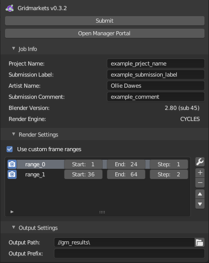

# Gridmarkets Blender Add-on
A Blender add-on for uploading Blender Projects to Gridmarkets and for specifying render jobs.

## Installing the Add-on

### Installing Dependencies
The add-on depends on the gridmarkets api library and blender-asset-tracer (BAT). Use `python setup.py wheels` to 
install the wheel dependencies to the `gridmarkets_blender_addon/lib` directory. Dependencies **must** be installed 
before using `bzip` or `fdist` as these will not currently check to make sure libraries are downloaded.

### Building .Zip File
To build the add-on as a .zip file that can be imported into blender run `python ./setup.py bzip`. The .zip will be 
output to the `./dist` directory by default or you can use the `-d` argument to pass a custom path. For example
`python .\setup.py bzip -d ./custom_path/zip_name`.

### Installing a Zipped Add-on
You can then import the build .zip file into Blender by going `edit -> preferences -> Add-ons -> install`. Active the 
add-on by searching `gridmarkets blender addon` and ticking it's checkbox.

### Implicit Instillation for Development
To save having to repack the add-on as a .zip and installing it into blender after each change you can either use 
`python .\setup.py fdist -d "path\to\blender addons\"` to directly install the add-on into blender (it will replace any 
existing add-ons of the same name) or you can setup Blender with a custom add-ons path to load the add-on directly from
the source files.

#### Custom Scripts Path
Setting up a custom scripts path is done by editing `edit -> prefereces -> File Paths -> Scripts` to point to a custom 
directory. This directory must be setup to mirror the structure of Blender's default scripts folder. This means it must 
contain an `addons` sub-directory which blender will use when searching for custom add-ons. You can then create a 
symlink to the location of your `gridmarkets-blender-addon\gridmarkets_blender_addon` folder. See 
https://docs.blender.org/manual/en/dev/preferences/file_paths.html#scripts-path for more information about using a 
custom scripts path.

#### Reloading Add-ons
To reload the add-on after making a change to the
add-on's source code use `F3` (or `Cmd + F` on MacOs) in Blender to open up the search window and search for 
`Reload Scripts`. This will reload the add-on.

## Using the Add-on
The add-on panel can be found under `Render -> Gridmarkets` in the Properties menu.

### Authentication
Once the add-on is installed a user can provide their Gridmarkets email and access key in the preferences section found
directly under the add-on in the Add-ons panel. 

For Blender to remember a users credentials between sessions they must click the `Save Preferences` button also shown in 
the above image.

### Submitting a Project
There is no requirement to save the .blend file before submitting, the add-on will automatically save a copy of the
currently open scene to a temporary directory. It will then create a packed version of the same file using BAT and 
upload via the API. 

## todo
- ~~Handle dependencies outside of the project root.~~
- ~~Handle linked blender files which themselves have their own dependencies.~~
- support blender 2.79
- Currently the add-on re-packs and re-uploads the entire project for each render, it should detect which files have
  been updated and act accordingly.
- ~~Remove the requirement to save the current .blend file before submitting~~
- ~~Allow the user to specify multiple frame ranges~~
- Add job status feedback to the user so they know the add-on is working as intended
- Clean up temp files generated from packing the project. (partially done, all temp folders will now be deleted once 
  blender is closed but they could be deleted sooner if we check that the files have finished uploading to envoy)
- [Extension] it would be possible to render single frames in a distributed way by creating a fake animation where each
  frame is the same and then re-combining the frames client side. Very usefull for artists who are trying to create 
  still images.