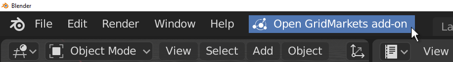

# GridMarkets Blender Add-on
A Blender add-on for uploading Blender Projects to GridMarkets and for specifying render jobs.

- [Installing the Add-on](#installing-the-add-on)
  - [Pre-built Files](#pre-built-files)
  - [Building from Sources](#building-from-sources)
    - [Installing Dependencies](#installing-dependencies)
    - [Building .Zip File](#building-zip-file)
  - [Installing the Zipped Add-on](#installing-the-zipped-add-on)
  - [Implicit Installation for Development](#implicit-installation-for-development)
    - [Custom Scripts Path](#custom-scripts-path)
  - [Reloading Add-ons](#reloading-add-ons)
- [Using the Add-on](#using-the-add-on)
  - [Authentication](#authentication)
  - [Submitting a Job](#submitting-a-job)
    - [Submit and upload at the same time](#submit-and-upload-at-the-same-time)
    - [Resubmit a job without reuploading](#resubmit-a-job-without-reuploading)
  - [Uploading Projects without Submitting](#uploading-projects-without-submitting)
  - [Importing Existing Projects](#importing-existing-projects)
  - [Job Presets](#job-presets)
  - [Submitting a V-Ray Scene](#submitting-a-v-ray-scene)

## Installing the Add-on

To install the add-on you must first either download one of the pre-built zip files or follow the below instructions for
how to build the add-on from source.

### Pre-built Files

| Blender Version   | Add-on Download Link|
|-------------------|--------|
| 2.8+  | [gridmarkets_blender_addon.zip (blender 2.8+)](https://github.com/Gridmarkets/gm-blender-addon/releases/latest/download/gridmarkets_blender_addon.zip)  |
| 2.79  | [gridmarkets_blender_addon.zip (blender 2.79)](https://github.com/Gridmarkets/gm-blender-addon/releases/download/v1.2.0/gridmarkets_blender_addon_v2_79.zip)  |

### Building from Sources

#### Installing Dependencies
The add-on depends on the GridMarkets api library and blender-asset-tracer (BAT). Use `python setup.py wheels` to 
install the wheel dependencies to the `gridmarkets_blender_addon/lib` directory. Dependencies **must** be installed 
before using `bzip` or `fdist` as these will not currently check to make sure libraries are downloaded.

#### Building .Zip File
To build the add-on as a .zip file that can be imported into blender run `python ./setup.py bzip`. The .zip will be 
output to the `./dist` directory by default or you can use the `-d` argument to pass a custom path. For example
`python .\setup.py bzip -d ./custom_path/zip_name`.

### Installing the Zipped Add-on
You can then import the built .zip file into Blender by going to `edit -> preferences -> Add-ons -> install`. Activate the 
add-on by searching `GridMarkets blender addon` and ticking it's checkbox.

>
>Note: If you already have the GridMarkets Blender add-on installed and want to update to a newer version it is best to 
**uninstall the previous version and then restart blender** before installing the new version. Otherwise you may 
encounter errors.

### Implicit Installation for Development
To save having to repack the add-on as a .zip and installing it into blender after each change you can either use 
`python .\setup.py fdist -d "path\to\blender addons\"` to directly install the add-on into blender (it will replace any 
existing add-ons of the same name) or you can setup Blender with a custom add-ons path to load the add-on directly from
the source files.

#### Custom Scripts Path
Setting up a custom scripts path is done by editing `edit -> prefereces -> File Paths -> Scripts` to point to a custom 
directory. This directory must be setup to mirror the structure of Blender's default scripts folder. This means it must 
contain an `addons` sub-directory which blender will use when searching for custom add-ons. You can then create a 
symlink to the location of the `gm-blender-addon\gridmarkets_blender_addon` folder. See 
https://docs.blender.org/manual/en/dev/preferences/file_paths.html#scripts-path for more information about using a 
custom scripts path.

For an example setup, in Windows create a folder called `C:\blender-addons` and set Blender's `Scripts` path to it (as 
described above). Then create a sub-directory called `addons` under the first folder. Create a symbolic link to the 
add-on using `mklink /D C:\blender-addons\addons\gridmarkets_blender_addon 
C:\<path to repo>\gm-blender-addon\gridmarkets_blender_addon` (using cmd not PowerShell). Now you should be able to 
activate the add-on within Blender, and reload any changes to the source without packing as a zip and re-installing.

#### Reloading Add-ons
To reload the add-on after making a change to the
add-on's source code use `F3` (or `Cmd + F` on MacOs) in Blender to open up the search window and search for 
`Reload Scripts`. This will reload the add-on.

## Using the Add-on
The add-on window can be opened by pressing the 'Open GridMarkets add-on' button in the top bar.

The add-on depends on GridMarkets' Envoy being installed and running in order to work.

### Authentication
You must provide your GridMarkets email and access key (__not your password__) before you can upload or submit any 
projects. You can do this under the __Credentials__ tab or under the add-on preferences section for the add-on. The 
add-on will only display the sign-in window until you have signed in.

For Blender to remember a users credentials between sessions they must click the `Save Preferences` button also shown in 
the above image.

The add-on will remember any account you use to sign in (so long as you save your preferences). Once you have signed-in
with at least one account the sign-in menu will a menu labeled `Saved user Profiles` from which you can load your 
credentials. You can also mark an account with a star which indicates to the add-on to try and automatically sign-in
using this account when opened.

### Submitting a Job

#### Submit and upload at the same time:
Once opened you have the option of submitting your current scene using blender's render settings in an easy one click
submit process. There is no requirement to save the .blend file before submitting, the add-on will automatically save a 
copy of the currently open scene to a temporary directory. It will then create a packed version of the same file using 
BAT and upload via the API. The temporary packed files will be deleted after they are uploaded.

#### Resubmit a job without reuploading:

You can submit jobs to projects you have already uploaded by selecting a different project option from the projects dropdown button.

### Uploading Projects without Submitting

If you want to upload a project without submitting a job to it you can use the **Upload Current Scene** or 
**Upload Packed Project** options under the **Upload** menu. This is useful if you want to check that your project has 
been uploaded correctly before submitting a job to it.

### Importing Existing Projects
You can import projects that you uploaded in the past (so long as they are still in Envoy) by using the **Manually 
specify details for existing Remote Project** option under the **misc** menu.

### Job Presets

You can also can define custom jobs that override blender's render and output settings to give you more control in the 
__Job Presets__ tab. 

Job preset attributes can infer their value form different sources. These include:

| Inference Source Name | Description |
|---|----|
| Constant | Use the pre-defined constant value for this attribute |
| User Defined | Use the value specified by the user in the form field |
| Application | Use the value specified by the application |
| Project | Read the value from the project's attributes when you submit |

### Submitting a V-Ray scene

(For blender 2.79) If you are using [V-Ray for Blender](https://docs.chaosgroup.com/display/VFBlender/Quick+Start+Guide) you can submit
V-Ray projects from Blender to GridMarkets using this add-on. To submit a V-Ray project just select the V-Ray engine 
and the `Submission Settings` view will change to include a V-Ray project submission form. Job Presets are currently 
only supported for blender's render engines so the `Job Presets` tab will not display while the V-Ray render engine is
selected.
